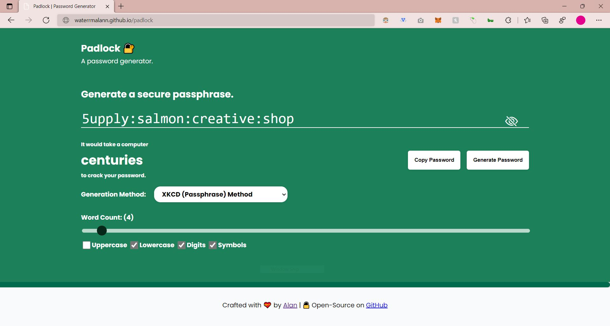

# 🔒 Padlock - Password Generator & Strength Checker

  

## [Demo](https://waterrmalann.github.io/padlock/)   |   [Source](https://github.com/waterrmalann/padlock/blob/main/js/main.js)

A sophisticated web based password generator with strength checking. There are four available generators which can be used to create cryptographically secure and unique password combinations. The app also calculates password strength and time required for an attacker to crack it for both generated passwords and inputted passwords. This whole project was written in HTML, CSS, and vanilla JavaScript with a few dependencies.

#### Third Party Libraries

- [math-random-polyfill](https://github.com/DavidAnson/math-random-polyfill) (*A cryptographically safe implementation of Math.random()*)
- [zxcvbn](https://github.com/dropbox/zxcvbn) (*Password strength estimation library.*)
- [gpw](https://multicians.org/thvv/gpw-js.html) (*Pronouncable passwords generator*)



---

### 🚀 Setup

A live version and up to date version of the web app is available [here](https://waterrmalann.github.io/padlock/). If you wish to modify the app or host it yourself, you can clone the repo and do whatever you want with it.

1. [Clone the repository](https://docs.github.com/en/github/creating-cloning-and-archiving-repositories/cloning-a-repository-from-github/cloning-a-repository).

```sh
git clone https://github.com/waterrmalann/padlock.git
```

2. Install the dependencies.

```sh
npm install
```

3. This will start a live server. Head to the IP shown in the console.

```sh
npm run serve
```

---

### To-Do

- Clean up the code and make it more consistent.
- Add site favicon.
- Add more generators.
- Add more words to passphrase generator.
- Make munged password outputs easier to read.
- [Bug] Fix password munging being inconsistent.

### 🤝 Contribution

Contributions are always accepted. Feel free to open a pull request to fix any issues or to make improvements you think that should be made. You could also help me with the to-do list above. Any contribution will be accepted as long as it doesn't stray too much from the objective of the app. If you're in doubt about whether the PR would be accepted or not, you can always open an issue to get my opinion on it.

License
----

MIT License, see [LICENSE](LICENSE)
